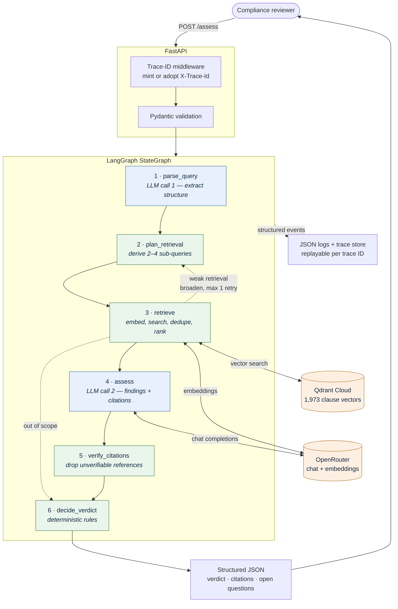

# Sharia Compliance Agent

An AI agent that assesses whether a proposed financial product or transaction is
Sharia-compliant, returning a structured verdict — `COMPLIANT`, `NON_COMPLIANT`,
or `NEEDS_REVIEW` — grounded in cited clauses from the AAOIFI *Shari'ah
Standards*.

Built for an internal compliance team: a reviewer asks a question in plain
English and gets back an auditable answer with the exact clauses that support
it, plus everything the agent could not determine.

> **Decision support, not a ruling.** Every response carries a disclaimer and
> requires review by a qualified Sharia reviewer. It does not substitute for
> Sharia Supervisory Board approval.

---

## What it does

```bash
curl -X POST http://localhost:8000/assess \
  -H "Content-Type: application/json" \
  -d '{"query": "Can we charge a late payment penalty on a Murabaha and keep it as bank income?"}'
```

```json
{
  "verdict": "NON_COMPLIANT",
  "confidence": 0.869,
  "rule": "grounded_prohibition",
  "rationale": "Prohibited under: Late payment penalty retained as bank income (riba).",
  "findings": [
    {
      "issue": "Late payment penalty retained as bank income (riba)",
      "severity": "PROHIBITED",
      "explanation": "The proposal explicitly charges a late payment penalty on a deferred Murabahah and keeps it as bank income. SS-08/4/8 states that after the Murabahah sale, it is not permitted to demand any extra payment for delay in payment...",
      "citations": [
        {
          "chunk_id": "SS-08/4/8",
          "doc_id": "SS-08",
          "section": "4/8",
          "title": "Murabahah",
          "quote": "It is not permitted subsequently to demand any extra payment either in consideration of extra time given for payment or for delay in payment that may be for a reason or no reason."
        }
      ]
    }
  ],
  "open_questions": [
    "Whether the bank is willing to restructure the penalty so that any amount collected is not retained as income...",
    "The exact mechanism for calculating the penalty and whether it is tied to the deferred price..."
  ],
  "recommended_actions": [
    "Do not implement a late payment penalty that is retained as bank income.",
    "If a late payment deterrent is desired, structure it as a charitable commitment by the customer...",
    "Obtain a Shariah board ruling on the permissible alternatives before proceeding."
  ],
  "rejected_citations": [],
  "model": "deepseek/deepseek-v4-flash-0731",
  "latency_ms": 14573,
  "trace_id": "a4d86abc888f44118649049a6e12b2bd"
}
```

*Real output, abridged. The cited clause is the actual AAOIFI rule on late
payment charges.*

---

## Architecture



**Blue nodes call the LLM. Green nodes are plain Python.**

The single most important property: **the LLM produces findings; deterministic
code produces the verdict.** The model is asked to identify issues and cite
clauses, never to choose the label. Aggregation lives in `app/agent/verdict.py`
as an ordered rule table, so identical findings always yield an identical
verdict and every rule is unit-testable.

This matters because the error costs are asymmetric. A false `COMPLIANT` ships a
prohibited product; a false `NEEDS_REVIEW` costs a reviewer an hour. Every
ambiguous path therefore resolves toward `NEEDS_REVIEW`, encoded in code rather
than hoped for in a prompt.

Two structures make it a graph rather than a chain:

- **A conditional retry edge** — when the best retrieval score falls below
  threshold, control returns to `plan_retrieval`, which broadens the sub-queries
  and retrieves once more.
- **A citation gate** — any citation not matching a retrieved chunk is stripped.
  A prohibition that loses all its citations is downgraded to `NEEDS_REVIEW`
  rather than convicting on fabricated evidence.

---

## Quick start

**Requirements:** Python 3.11+, an [OpenRouter](https://openrouter.ai/keys) API
key, and a [Qdrant Cloud](https://cloud.qdrant.io) cluster (free tier is ample).

```bash
git clone https://github.com/AhmadKElsayed/Sharia-Compliance-Agent.git
cd Sharia-Compliance-Agent

python -m venv .venv
.venv\Scripts\activate          # Windows
source .venv/bin/activate       # macOS / Linux

pip install -r requirements-ingest.txt   # runtime + PDF extraction
cp .env.example .env                     # then fill in your keys
```

Build the vector index (once, ~30 seconds, about $0.02 in embeddings):

```bash
python scripts/ingest.py --dry-run   # parse and report, no network
python scripts/ingest.py             # embed and upsert into Qdrant
```

Run the API:

```bash
uvicorn app.main:app --reload
```

Open <http://localhost:8000/docs> for the interactive OpenAPI UI.

> **Runtime vs. ingest dependencies.** `requirements.txt` is what the deployed
> service needs. `requirements-ingest.txt` adds PyMuPDF and ReportLab, used only
> by the offline extractor — PyMuPDF is AGPL and never enters the runtime image.

---

## API

| Method | Path | Purpose |
|---|---|---|
| `POST` | `/assess` | Submit a query, receive a structured verdict |
| `GET` | `/health` | Liveness and readiness |
| `GET` | `/corpus` | What is indexed |
| `GET` | `/traces/{trace_id}` | Replay an assessment for audit |
| `GET` | `/docs` | OpenAPI UI |

Every response carries an `X-Trace-Id` header. Supply your own to correlate with
an upstream system, and it is adopted when well formed.

### `GET /health`

Returns `200` only when the service can actually answer an assessment, and `503`
when a dependency is down, the collection is empty, or configuration is
incomplete. A green check while the vector store is unreachable would be worse
than no check at all.

```json
{
  "status": "ok",
  "version": "0.1.0",
  "corpus_chunks": 1973,
  "collection": "aaoifi_ss_en",
  "chat_model": "deepseek/deepseek-v4-flash-0731",
  "embedding_model": "openai/text-embedding-3-large",
  "dependencies": [
    { "name": "qdrant", "ok": true, "detail": "1973 vectors" },
    { "name": "openrouter", "ok": true, "detail": "key configured" }
  ],
  "missing_config": []
}
```

### `GET /traces/{trace_id}`

Replays what the agent actually saw and decided:

```bash
curl http://localhost:8000/traces/a4d86abc888f44118649049a6e12b2bd
```

```
sharia.api     request.received      [path, query]
sharia.agent   retrieval.result      [chunks, sub_queries, top_score]
sharia.agent   verdict.decided       [confidence, rule, verdict]
sharia.api     request.completed     [latency_ms, rejected_citations, verdict, ...]
```

Traces are held in a bounded in-process store, so they are lost on restart and
are not shared across instances — a demonstrator, not the production audit
trail.

### Errors

Errors use the same envelope shape as success, never a bare string:

```json
{
  "trace_id": "…",
  "error": { "code": "upstream_llm_error", "message": "The language model could not be reached…" }
}
```

`422` invalid request · `404` unknown trace · `500` unexpected failure ·
`502` upstream LLM failure · `503` not ready

---

## How it works

### Corpus and chunking

The corpus is the AAOIFI *Shari'ah Standards*, English edition: **1,264 pages,
54 standards, 1,973 normative clauses**.

**The chunk unit is one clause.** AAOIFI numbers every rule (`2/1/2`), and those
boundaries were chosen by the drafters — fixed token windows would cut rules in
half.

**Each clause embeds under its full lineage** ("clause-level chunking with
hierarchical contextual headers"):

```
Shari'ah Standard No.(8) Murabahah > 2. Procedures Prior to the Contract of
Murabahah > 2/1 The customer's expression of his wish... > clause 2/1/2

With due consideration to item 2/2/3, it is permissible for the customer to
request the Institution to purchase the item from a particular source...
```

Without the prefix, AAOIFI clauses embed almost identically — the register is
deliberately elliptical, and dozens of rules open *"It is permissible for the
Institution to…"*. This is **not** LLM-generated context: the lineage is read
from the document's own heading hierarchy, so it costs nothing and is perfectly
reproducible.

Appendices (drafting history, juristic reasoning) are detected and excluded —
they are not operative rules and indexing them alongside rules pollutes
retrieval.

### Extraction

The source PDF fakes bold by drawing every span twice, which naive extraction
turns into `"Hamish JiddiyyahHamish Jiddiyyah"`. Span analysis showed 66 spans
per page of which 33 were unique, making the fix exact rather than heuristic:
drop any span already drawn at the same coordinates.

### Retrieval

Each assessment derives 2–4 sub-queries from the parsed product features rather
than embedding the raw question once, then merges and ranks the results. On
measured examples, in-scope queries score 0.40–0.68 while an out-of-scope query
scores 0.19, which is what makes the coverage threshold a usable
`NEEDS_REVIEW` signal.

---

## Configuration

All settings live in `app/config.py` and load from `.env`. See `.env.example`.

| Variable | Default | Notes |
|---|---|---|
| `OPENROUTER_API_KEY` | — | Required. Chat and embeddings share one key. |
| `OPENROUTER_MODEL` | `deepseek/deepseek-v4-flash-0731` | Chat model. |
| `OPENROUTER_FALLBACK_MODELS` | — | Comma-separated, tried in order on failure. |
| `OPENROUTER_EMBEDDING_MODEL` | `openai/text-embedding-3-large` | Changing this changes `EMBEDDING_DIM`. |
| `EMBEDDING_DIM` | `3072` | Must match the model, or ingest fails loudly. |
| `OPENROUTER_PROVIDER_SORT` | `throughput` | See note below. |
| `LLM_REASONING_EFFORT` | `low` | `low`, `medium`, `high`, or empty to disable. |
| `LLM_MAX_TOKENS` | `12000` | Must cover the reasoning pass *and* the answer. |
| `QDRANT_URL` / `QDRANT_API_KEY` | — | Required. |
| `QDRANT_COLLECTION` | `aaoifi_ss_en` | |
| `RETRIEVAL_TOP_K` | `5` | Per sub-query. |
| `RETRIEVAL_SCORE_THRESHOLD` | `0.35` | Below this, coverage is judged insufficient. |
| `LOG_LEVEL` / `LOG_FILE` | `INFO` / `logs/app.jsonl` | |

Two defaults are measured rather than guessed:

**`OPENROUTER_PROVIDER_SORT=throughput`** — OpenRouter serves this model from 29
providers. Default routing selected one running at 15.6 tok/s; throughput-sorted
routing selected one at 130.3 tok/s.

**`LLM_REASONING_EFFORT=low`** — benchmarked across four queries, `low` and
disabled both produced 4/4 correct verdicts while `high` produced 3/4. Given a
larger budget the model invents `CONDITIONAL` findings about details the query
never raised, downgrading correct `COMPLIANT` verdicts. More reasoning is not
monotonically better here.

---

## Testing

```bash
pytest -q            # 137 tests, ~8s, no network, no credentials
```

The suite runs entirely offline: an in-memory vector store implements the same
protocol as Qdrant, a deterministic hashing embedder stands in for the API, and
the LLM is scripted. Coverage focuses on the properties that matter:

- **Fabricated citations cannot convict** — a hallucinated reference is stripped
  and the verdict downgrades to `NEEDS_REVIEW`
- **Empty findings never yield `COMPLIANT`** — silence is not evidence
- **Weak retrieval forces review**, and the broaden-retry edge fires exactly once
- **Extraction integrity** — clause IDs unique, no duplicated text, headings
  excluded
- **API contract** — status codes, error envelope, trace header, and `/health`
  reporting `503` honestly

---

## Project structure

```
app/
  main.py              FastAPI app, endpoints, lifespan
  config.py            Settings, validation
  schemas.py           Public request/response contract
  agent/
    graph.py           StateGraph wiring, conditional edges
    nodes.py           The six node functions
    verdict.py         Deterministic verdict rules
    prompts.py         Versioned prompt templates
    llm.py             OpenRouter client, fallback chain, JSON repair
  rag/
    aaoifi.py          AAOIFI PDF extractor (span dedup, clause hierarchy)
    chunking.py        Chunk model, contextual headers
    embedder.py        Embedder protocol; OpenRouter + offline hashing
    store.py           VectorStore protocol; Qdrant + in-memory
    ingest.py          Load, chunk, embed, upsert
  observability/
    trace.py           Trace-ID contextvar and middleware
    logging_setup.py   JSON-lines logging
    traces.py          Bounded trace store for replay
corpus/                Source PDFs, demo corpus, markdown sources
scripts/               ingest.py, build_corpus_pdfs.py
tests/                 137 tests
```

---

## Known limitations

- **Decision support only.** Not a Sharia ruling; requires review by a qualified
  reviewer and does not substitute for Sharia Supervisory Board approval.
- **No evaluation set yet.** Retrieval and verdict quality are evidenced by spot
  checks, not measurement. This is the most valuable next investment.
- **Verdicts are not fully deterministic.** On one borderline query, five
  identical runs produced two `COMPLIANT` and three `NEEDS_REVIEW`.
- **English only.** Arabic is the authoritative AAOIFI text, so the system
  currently reasons from a translation. Clause numbering is identical across
  editions and `lang` is already a payload field, so adding Arabic is a filter
  and a re-ingest rather than a redesign.
- **Retrieval is single-stage.** No reranker; one observed miss (a takaful query
  failing to surface Standard 26) would likely be fixed by a cross-encoder.
- **Synchronous.** Each request holds a worker for 9–20 seconds.
- **Unauthenticated**, with per-process rate limiting only.
- **Traces are in-process** and lost on restart.

Architecture rationale, production scaling, evaluation design, and security
analysis are covered separately in the architecture and trade-offs document.
