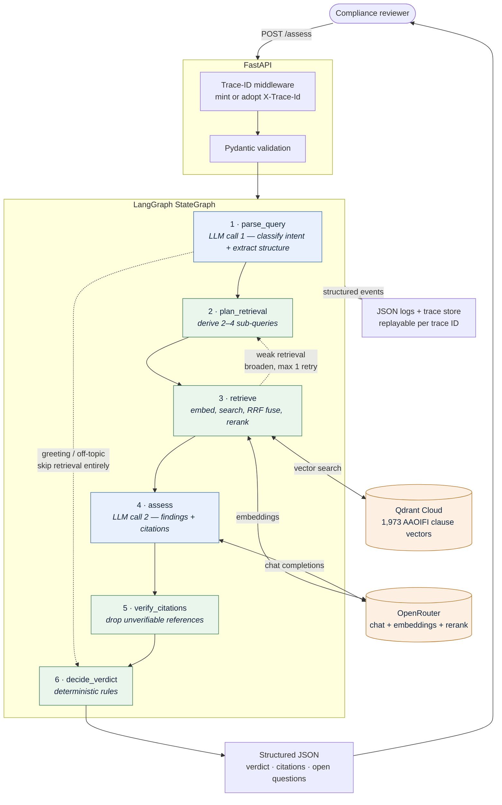

# Sharia Compliance Agent

An AI agent that assesses whether a proposed financial product or transaction is
Sharia-compliant, returning a structured verdict — `COMPLIANT`, `NON_COMPLIANT`
or `NEEDS_REVIEW` — grounded in cited clauses from the AAOIFI *Shari'ah
Standards*.

Built for an internal compliance team: a reviewer asks a question in plain
English and gets back an auditable answer with the exact clauses that support
it, plus everything the agent could not determine.

**Live:** <https://sharia-compliance-agent.onrender.com/docs> · no sign-in
required

> **The knowledge base is the real thing.** Not a synthesised or summarised
> corpus — this indexes the actual published AAOIFI *Shari'ah Standards*
> (English edition): **1,264 pages, 54 standards, 1,973 normative clauses**,
> parsed clause by clause from the source PDF. Every citation resolves to a real
> AAOIFI rule number a reviewer can look up in the book.

> **Decision support, not a ruling.** Every response carries a disclaimer and
> requires review by a qualified Sharia reviewer. It does not substitute for
> Sharia Supervisory Board approval.

---

## What it does

```bash
curl -X POST https://sharia-compliance-agent.onrender.com/assess \
  -H "Content-Type: application/json" \
  -d '{"query": "Can we charge a late payment penalty on a Murabaha and keep it as bank income?"}'
```

> The free instance sleeps after 15 minutes idle, so the first request may take
> ~50s to cold-start. Subsequent assessments run in 9–25s.

```json
{
  "verdict": "NON_COMPLIANT",
  "confidence": 0.869,
  "rule": "grounded_prohibition",
  "rationale": "Prohibited under: Late payment penalty retained as bank income (riba).",
  "findings": [
    {
      "issue": "Late payment penalty retained as bank income (riba)",
      "severity": "PROHIBITED",
      "explanation": "The proposal explicitly charges a late payment penalty on a deferred Murabahah and keeps it as bank income. SS-08/4/8 states that after the Murabahah sale, it is not permitted to demand any extra payment for delay in payment...",
      "citations": [
        {
          "chunk_id": "SS-08/4/8",
          "doc_id": "SS-08",
          "section": "4/8",
          "title": "Murabahah",
          "quote": "It is not permitted subsequently to demand any extra payment either in consideration of extra time given for payment or for delay in payment that may be for a reason or no reason."
        }
      ]
    }
  ],
  "open_questions": [
    "Whether the bank is willing to restructure the penalty so that any amount collected is not retained as income...",
    "The exact mechanism for calculating the penalty and whether it is tied to the deferred price..."
  ],
  "recommended_actions": [
    "Do not implement a late payment penalty that is retained as bank income.",
    "If a late payment deterrent is desired, structure it as a charitable commitment by the customer...",
    "Obtain a Shariah board ruling on the permissible alternatives before proceeding."
  ],
  "rejected_citations": [],
  "model": "deepseek/deepseek-v4-flash-0731",
  "latency_ms": 14573,
  "trace_id": "a4d86abc888f44118649049a6e12b2bd"
}
```

*Real output, abridged. The cited clause is the actual AAOIFI rule on late
payment charges.*

---

## Architecture



**Blue nodes call the LLM. Green nodes are plain Python.**

The single most important property: **the LLM produces findings; deterministic
code produces the verdict.** The model is asked to identify issues and cite
clauses, never to choose the label. Aggregation lives in `app/agent/verdict.py`
as an ordered rule table, so identical findings always yield an identical
verdict and every rule is unit-testable.

This matters because the error costs are asymmetric. A false `COMPLIANT` ships a
prohibited product; a false `NEEDS_REVIEW` costs a reviewer an hour. Every
ambiguous path therefore resolves toward `NEEDS_REVIEW`, encoded in code rather
than hoped for in a prompt.

Three structures make it a graph rather than a chain:

- **An intent router** — `parse_query` classifies every message as `GREETING`,
  `ASSESSMENT` or `OTHER`, and only an `ASSESSMENT` reaches retrieval. The other
  two return `IRRELEVANT` and are never embedded, searched or reranked. The
  classification rides on the parse call that already runs, so it costs no extra
  request.
- **A conditional retry edge** — when the best retrieval score falls below
  threshold, control returns to `plan_retrieval`, which broadens the sub-queries
  and retrieves once more.
- **A citation gate** — any citation not matching a retrieved chunk is stripped.
  A prohibition that loses all its citations is downgraded to `NEEDS_REVIEW`
  rather than convicting on fabricated evidence.

The router is an LLM rather than a keyword list. A word list was tried first and
rejected: it cannot cover other languages, transliterated salutations, typos or
informal phrasing without growing indefinitely, and each word added widens the
chance of swallowing a real query. The model handles `merhaba` and
`"hows it going mate"` while still routing `"Hi, can we guarantee a fixed
return?"` to a full assessment. An unrecognised label falls back to
`ASSESSMENT` — greeting a real compliance question is the costly direction to
fail in.

Skipping retrieval is not only about latency. Retrieving for an already-rejected
message sends its text to a second upstream provider for nothing (§5 Risk 1 in
the trade-offs document), and it wrote plausible-looking but meaningless hits
into the trace — a greeting retrieved Salam and Online Dealings clauses at a top
score of 0.11, where they read as though they had been considered.

### Verdicts

| Verdict | Meaning |
|---|---|
| `COMPLIANT` | Every identified issue is supported by a clause permitting the structure |
| `NON_COMPLIANT` | A prohibition applies, with a citation that survived verification |
| `NEEDS_REVIEW` | A real product question a reviewer must settle — conditional, unresolved, or beyond the corpus |
| `IRRELEVANT` | **Not an assessment.** A greeting or an off-topic message; nothing was retrieved and nothing was judged |

`IRRELEVANT` exists because folding these into `NEEDS_REVIEW` told a reviewer
that a greeting required their attention, and put greetings in the same bucket as
genuinely borderline products — the population a reviewer actually works from.
The brief names three verdicts, and those three remain the only *assessment*
outcomes; `IRRELEVANT` says no assessment happened. Responses carrying it also
drop the standard disclaimer, which would otherwise claim an assessment was
generated from retrieved standards text when none was.

---

## Quick start

**Requirements:** Python 3.11+, an [OpenRouter](https://openrouter.ai/keys) API
key, and a [Qdrant Cloud](https://cloud.qdrant.io) cluster (free tier is ample).

```bash
git clone https://github.com/AhmadKElsayed/Sharia-Compliance-Agent.git
cd Sharia-Compliance-Agent

python -m venv .venv
.venv\Scripts\activate          # Windows
source .venv/bin/activate       # macOS / Linux

pip install -r requirements-ingest.txt   # runtime + PDF extraction
cp .env.example .env                     # then fill in your keys
```

Build the vector index (once, ~30 seconds, about $0.02 in embeddings):

```bash
python scripts/ingest.py --dry-run   # parse and report, no network
python scripts/ingest.py             # embed and upsert into Qdrant
```

Run the API:

```bash
uvicorn app.main:app --reload
```

Open <http://localhost:8000/docs> for the interactive OpenAPI UI.

> **Runtime vs. ingest dependencies.** `requirements.txt` is what the deployed
> service needs. `requirements-ingest.txt` adds PyMuPDF and ReportLab, used only
> by the offline extractor — PyMuPDF is AGPL and never enters the runtime image.

---

## API

| Method | Path | Purpose |
|---|---|---|
| `POST` | `/assess` | Submit a query, receive a structured verdict |
| `GET` | `/health` | Liveness and readiness |
| `GET` | `/corpus` | What is indexed |
| `GET` | `/traces/{trace_id}` | Replay an assessment for audit |
| `GET` | `/docs` | OpenAPI UI |

Every response carries an `X-Trace-Id` header. Supply your own to correlate with
an upstream system, and it is adopted when well formed.

### `GET /health`

Returns `200` only when the service can actually answer an assessment, and `503`
when a dependency is down, the collection is empty, or configuration is
incomplete. A green check while the vector store is unreachable would be worse
than no check at all.

```json
{
  "status": "ok",
  "version": "0.1.0",
  "corpus_chunks": 1973,
  "collection": "aaoifi_ss_en",
  "chat_model": "deepseek/deepseek-v4-flash-0731",
  "embedding_model": "openai/text-embedding-3-large",
  "dependencies": [
    { "name": "qdrant", "ok": true, "detail": "1973 vectors" },
    { "name": "openrouter", "ok": true, "detail": "key configured" }
  ],
  "missing_config": []
}
```

### `GET /traces/{trace_id}`

Replays what the agent actually saw and decided:

```bash
curl http://localhost:8000/traces/a4d86abc888f44118649049a6e12b2bd
```

```
sharia.api     request.received      [path, query]
sharia.agent   retrieval.result      [chunks, sub_queries, top_score]
sharia.agent   verdict.decided       [confidence, rule, verdict]
sharia.api     request.completed     [latency_ms, rejected_citations, verdict, ...]
```

Traces are held in a bounded in-process store, so they are lost on restart and
are not shared across instances — a demonstrator, not the production audit
trail.

### Errors

Errors use the same envelope shape as success, never a bare string:

```json
{
  "trace_id": "…",
  "error": { "code": "upstream_llm_error", "message": "The language model could not be reached…" }
}
```

`422` invalid request · `404` unknown trace · `500` unexpected failure ·
`502` upstream LLM failure · `503` not ready

---

## How it works

### Corpus — the real AAOIFI standards

The knowledge base is the **actual AAOIFI *Shari'ah Standards*, English
edition** — the published reference that Islamic financial institutions are
audited against — parsed directly from the source PDF: **1,264 pages, 54
standards, 1,973 normative clauses**, ~103,500 words.

This was a deliberate choice over a synthesised corpus. A demo built on
paraphrased rules can produce fluent output that no reviewer can verify; here,
every citation is a real AAOIFI clause number (`SS-08 §4/8`) that resolves to a
specific rule in the published book. It also meant the hard problems were real
ones — a duplicated PDF text layer, six standards with inconsistent heading
formats, and 336 numbered lines that are section headings rather than rules (see
[Extraction](#extraction)).

The source PDFs live in [corpus/pdf/](corpus/pdf/). A small synthesised corpus
is kept in [corpus/demo/](corpus/demo/) so the test suite and a fresh clone run
without them.

### Chunking

**The chunk unit is one clause.** AAOIFI numbers every rule (`2/1/2`), and those
boundaries were chosen by the drafters — fixed token windows would cut rules in
half.

**Each clause embeds under its full lineage** ("clause-level chunking with
hierarchical contextual headers"):

```
Shari'ah Standard No.(8) Murabahah > 2. Procedures Prior to the Contract of
Murabahah > 2/1 The customer's expression of his wish... > clause 2/1/2

With due consideration to item 2/2/3, it is permissible for the customer to
request the Institution to purchase the item from a particular source...
```

Without the prefix, AAOIFI clauses embed almost identically — the register is
deliberately elliptical, and dozens of rules open *"It is permissible for the
Institution to…"*. This is **not** LLM-generated context: the lineage is read
from the document's own heading hierarchy, so it costs nothing and is perfectly
reproducible.

Appendices (drafting history, juristic reasoning) are detected and excluded —
they are not operative rules and indexing them alongside rules pollutes
retrieval.

### Extraction

Working from the real document meant three real problems, two of which corrupted
data silently.

**A duplicated text layer.** The PDF fakes bold by drawing every span twice,
which naive extraction turns into `"Hamish JiddiyyahHamish Jiddiyyah"`. Span
analysis showed 66 spans per page of which 33 were unique, making the fix exact
rather than heuristic: drop any span already drawn at the same coordinates.

**A one-character regex bug that produced wrong citations.** Standards 42–44 and
46–48 are headed `"No (44)"` while the rest use `"No. (8)"`. The header pattern
required the period, so those six standards were invisible and their clauses
silently inherited the *preceding* standard's number — clauses from *Obtaining
and Deploying Liquidity* were being cited as *Islamic Reinsurance*. Nothing
failed; it surfaced only because Standard 41 had an implausible 106 clauses. In a
compliance tool this is the worst class of defect: confident and wrong.

**Headings that look like rules.** A two-level number such as `2/1` is a heading
where clauses nest beneath it and a rule where they do not, so it is resolved per
standard rather than by depth — 336 headings excluded from the index.

### Retrieval

Four stages, each added to fix a measured failure:

```
query
  → 2–4 grounded sub-queries      anchored to the product, not bare concepts
  → one batched embedding call    all sub-queries together (3072-d)
  → vector search, top_k=10 each  Qdrant
  → RRF fusion, K=60              rank-based, not score-based
  → cross-encoder rerank, 24 → 8  voyageai/rerank-2.5
```

**Embeddings are batched.** Sub-queries were embedded one per call — four
sequential round trips where one would do. Measured live: 1,925 ms sequential
against 594 ms batched, about **1.3s off every assessment**. It saves no money
(embeddings are billed per token, and the token count is identical) — the win is
latency and rate-limit headroom. Falls back to individual calls if the batch
fails *or returns the wrong number of vectors*, since a truncated response would
otherwise pair vectors with the wrong sub-queries and silently retrieve for text
nobody asked about.

**Sub-queries are grounded in the product.** An early version emitted bare
concept names, so a savings-account question produced the sub-query `"riba"` and
retrieved the general prohibition instead of the deposit rules that govern it.
Sub-queries are now anchored — `"savings account guaranteed return"` — which
fixed the first production retrieval failure.

**Fusion is rank-based.** Similarity scores from different sub-queries are not on
a common scale, so averaging them is arithmetic on incomparable numbers.
Reciprocal rank fusion uses only within-query rank, which is comparable by
construction.

**Reranking is never a dependency.** If the rerank call fails, retrieval falls
back to the fused order and records the degradation — a degraded ranking beats a
failed assessment.

### Latency

Where an assessment actually spends its time:

| Stage | Time | |
|---|---|---|
| `parse_query` | 3–8s | LLM call 1 |
| `retrieve` | ~1.9s | 0.6s embed (batched) · 0.7s search · 0.6s rerank |
| `assess` | 5–15s | LLM call 2 |
| `verify` + `decide_verdict` | <1ms | pure Python |
| **total** | **9–25s** | |

**The two LLM calls are ~90% of it.** Retrieval is under two seconds, which is
why the tuning in this section is about quality rather than speed — and why the
production fix in the trade-offs document is async request handling, not a faster
retriever.

Add ~50s to the first request after idle: the free Render instance sleeps.

### Measured retrieval quality

`evals/golden_set.py` pairs 66 queries with the AAOIFI standards a competent
reviewer would consult, plus 3 out-of-scope queries. It runs the real retrieval
path with **no LLM in the loop**, so a regression can be attributed without model
variance confounding it:

```bash
python scripts/eval_retrieval.py              # ~90s for all 66 cases
python scripts/eval_retrieval.py --no-rerank  # compare configurations
```

*That 90s is the whole run — ~1.3s per case. A single user assessment takes
9–25s, dominated by the two LLM calls the eval deliberately skips.*

Cases carry a **kind**, because an aggregate hides what matters:

| Kind | Cases | What a miss means | Recall |
|---|---|---|---|
| `coverage` | 50 | A topic is unreachable | **1.000** |
| `near_miss` | 8 | Retrieval keys on vocabulary, not the transaction | **0.875** |
| `adversarial` | 8 | A euphemised prohibition never reached the model | **1.000** |

Aggregate: **recall 0.985, recall@1 0.833, MRR 0.890, precision 0.733**. All 54
standards are covered. Out-of-scope queries top out at **0.255** against a 0.35
coverage threshold, which is what makes that threshold a usable `NEEDS_REVIEW`
signal rather than a guess.

**The set is not meant to sit at 1.000.** It did, at 22 cases — which says the
suite has stopped measuring, not that the system is perfect. The adversarial and
near-miss cases sit deliberately at the edge of what retrieval can currently do.

**How the current configuration was chosen** (measured on the 22-case set, so the
absolute numbers are a snapshot; the comparison between rows is what matters):

| Configuration | Recall | MRR | Latency/query |
|---|---|---|---|
| top_k=5, no rerank | 0.955 | 0.898 | 0.72s |
| top_k=10, no rerank | 0.955 | 0.898 | 0.66s |
| top_k=5, rerank | 0.955 | 0.895 | 1.18s |
| **top_k=10, rerank** *(current)* | **1.000** | **0.924** | 1.26s |

**Neither change helps alone.** At k=5 the governing clause never enters the
candidate pool, so the reranker has nothing to promote; at k=10 without reranking
it enters but sits below the cutoff. Shipped separately, either would have looked
like a no-op.

**The one standing miss names a real dependency.** Ask *"what conditions apply to
a Salam contract"* and retrieval returns 6 of 8 hits from SS-10. Describe the
identical transaction the way a business proposal would — *"the customer pays the
full price now and we deliver the wheat in six months"* — and it returns none. In
the full pipeline `parse_query` labels it `"salam sale"` and SS-10 comes back at
rank 2, so this is not broken in production. But retrieval is being carried by
the LLM's contract-type labelling rather than by the description, which turns a
parse error into a silent retrieval failure. The case is kept failing on purpose.

> These pairs were written by an engineer reading the corpus, not by a Sharia
> scholar. They detect retrieval regressions and compare retrieval strategies.
> They do **not** certify verdict correctness.

---

## Configuration

All settings live in `app/config.py` and load from `.env`. See `.env.example`.

| Variable | Default | Notes |
|---|---|---|
| `OPENROUTER_API_KEY` | — | Required. Chat and embeddings share one key. |
| `OPENROUTER_MODEL` | `deepseek/deepseek-v4-flash-0731` | Chat model. |
| `OPENROUTER_FALLBACK_MODELS` | — | Comma-separated, tried in order on failure. |
| `OPENROUTER_EMBEDDING_MODEL` | `openai/text-embedding-3-large` | Changing this changes `EMBEDDING_DIM`. |
| `EMBEDDING_DIM` | `3072` | Must match the model, or ingest fails loudly. |
| `OPENROUTER_PROVIDER_SORT` | `throughput` | See note below. |
| `LLM_REASONING_EFFORT` | `low` | `low`, `medium`, `high`, or empty to disable. |
| `LLM_MAX_TOKENS` | `12000` | Must cover the reasoning pass *and* the answer. |
| `QDRANT_URL` / `QDRANT_API_KEY` | — | Required. |
| `QDRANT_COLLECTION` | `aaoifi_ss_en` | |
| `RETRIEVAL_TOP_K` | `10` | Per sub-query. See note below. |
| `RETRIEVAL_SCORE_THRESHOLD` | `0.35` | Below this, coverage is judged insufficient. |
| `RERANK_ENABLED` | `true` | Cross-encoder reranking over the fused candidates. |
| `RERANK_MODEL` | `voyageai/rerank-2.5` | Served via OpenRouter, so no extra key. |
| `RERANK_CANDIDATES` | `24` | Pool size before reranking down to 8 excerpts. |
| `LOG_PROMPTS` | `true` | Logs the resolved prompt. **Disable in production.** |
| `LOG_LEVEL` / `LOG_FILE` | `INFO` / `logs/app.jsonl` | |

Three defaults are measured rather than guessed:

**`OPENROUTER_PROVIDER_SORT=throughput`** — OpenRouter serves this model from 29
providers. Default routing selected one running at 15.6 tok/s; throughput-sorted
routing selected one at 130.3 tok/s.

**`LLM_REASONING_EFFORT=low`** — benchmarked across four queries, `low` and
disabled both produced 4/4 correct verdicts while `high` produced 3/4. Given a
larger budget the model invents `CONDITIONAL` findings about details the query
never raised, downgrading correct `COMPLIANT` verdicts. More reasoning is not
monotonically better here.

**`RETRIEVAL_TOP_K=10` with `RERANK_ENABLED=true`** — measured on the golden set
above; the pair takes recall from 0.955 to 1.000, and neither half helps alone.

---

## Testing

```bash
pytest -q            # 174 tests, ~8s, no network, no credentials
```

The suite runs entirely offline: an in-memory vector store implements the same
protocol as Qdrant, a deterministic hashing embedder stands in for the API, and
the LLM is scripted. Coverage focuses on the properties that matter:

- **Fabricated citations cannot convict** — a hallucinated reference is stripped
  and the verdict downgrades to `NEEDS_REVIEW`
- **Empty findings never yield `COMPLIANT`** — silence is not evidence
- **Weak retrieval forces review**, and the broaden-retry edge fires exactly once
- **Extraction integrity** — clause numbering preserved, running headers
  stripped, clauses rejoined across page breaks *(covers `pdf_loader.py`; the
  AAOIFI extractor is exercised only indirectly — see limitations)*
- **API contract** — status codes, error envelope, trace header, and `/health`
  reporting `503` honestly
- **Reranking degrades, never fails** — a reranker that raises or times out
  leaves retrieval working on the fused order

---

## Project structure

```
app/
  main.py              FastAPI app, endpoints, lifespan
  config.py            Settings, validation
  schemas.py           Public request/response contract
  agent/
    graph.py           StateGraph wiring, conditional edges
    nodes.py           The six node functions
    verdict.py         Deterministic verdict rules
    prompts.py         Versioned prompt templates
    llm.py             OpenRouter client, fallback chain, JSON repair
  rag/
    aaoifi.py          AAOIFI PDF extractor (span dedup, clause hierarchy)
    chunking.py        Chunk model, contextual headers
    embedder.py        Embedder protocol; OpenRouter + offline hashing
    store.py           VectorStore protocol; Qdrant + in-memory
    rerank.py          Reranker protocol; OpenRouter cross-encoder
    ingest.py          Load, chunk, embed, upsert
  observability/
    trace.py           Trace-ID contextvar and middleware
    logging_setup.py   JSON-lines logging
    traces.py          Bounded trace store for replay
corpus/
  pdf/                 The real AAOIFI Shari'ah Standards (EN + AR)
  demo/                Synthesised corpus, so a clone runs without them
  source/              Markdown sources for the demo corpus
evals/golden_set.py    66 cases: coverage, near-miss, adversarial
scripts/               ingest.py, eval_retrieval.py, build_corpus_pdfs.py
tests/                 174 tests
```

---

## Known limitations

- **Decision support only.** Not a Sharia ruling; requires review by a qualified
  reviewer and does not substitute for Sharia Supervisory Board approval.
- **Verdict quality is unmeasured.** Retrieval is measured (above); verdict
  correctness is not. That needs a scholar-authored eval set, and until it
  exists the false-`COMPLIANT` rate — the one error that can cause real harm —
  is unknown. This is the most valuable next investment.
- **Verdicts are not fully deterministic.** On one borderline query, five
  identical runs produced two `COMPLIANT` and three `NEEDS_REVIEW`.
- **English only.** Arabic is the authoritative AAOIFI text, so the system
  currently reasons from a translation. Clause numbering is identical across
  editions and `lang` is already a payload field, so adding Arabic is a filter
  and a re-ingest rather than a redesign — the Arabic PDF is already in the
  repository.
- **Appendices excluded.** The juristic reasoning behind each ruling is not
  indexed, so the agent can state a rule but not the reasoning behind it.
- **The AAOIFI extractor has no dedicated tests.** The most intricate module —
  the one that produced a silent citation-corruption bug — is exercised only
  indirectly. The next extraction regression would be found the way the last one
  was: by a human noticing an implausible number.
- **Synchronous.** Each request holds a worker for 9–25 seconds.
- **Unauthenticated**, with per-process rate limiting only.
- **Traces are in-process** and lost on restart.
- **`LOG_PROMPTS` defaults on**, writing query text to logs in plaintext.
  Reproducibility beats confidentiality in a demonstrator; that inverts in
  production.

Architecture rationale, production scaling, evaluation design, and security
analysis are covered separately in the architecture and trade-offs document.
